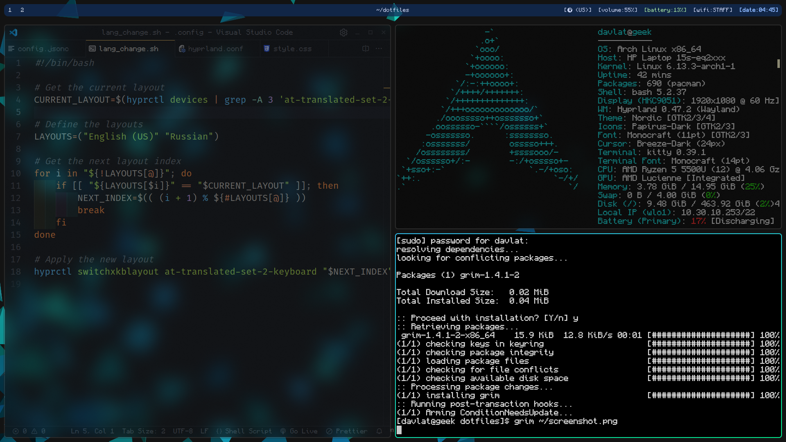

# Hyprland + Arch Linux

> Dotfiles with panels, theme picker, and other tweaks.

## Dependencies

To set up Hyprland with essential components, install the following packages in one command:

```sh
sudo pacman -S base-devel git hyprland wayland wlroots xdg-desktop-portal-hyprland mesa lib32-mesa vulkan-radeon lib32-vulkan-radeon thunar gvfs kitty wofi brightnessctl pipewire pipewire-alsa pipewire-pulse pipewire-jack wireplumber
```

### Installed Dependencies

This command will install the following dependencies:

- **Development Tools**: `base-devel`, `git`
- **Wayland & Hyprland**: `hyprland`, `wayland`, `wlroots`, `xdg-desktop-portal-hyprland`
- **AMD Drivers**: `mesa`, `lib32-mesa`, `vulkan-radeon`, `lib32-vulkan-radeon`
- **File Manager & Utilities**: `thunar`, `gvfs`
- **Terminal Emulator**: `kitty`
- **Application Launcher**: `wofi`
- **Brightness Control**: `brightnessctl`
- **Audio System**: `pipewire`, `pipewire-alsa`, `pipewire-pulse`, `pipewire-jack`, `wireplumber`

These dependencies will ensure a fully functional Hyprland setup with essential tools. Let me know if you need additional configurations!
